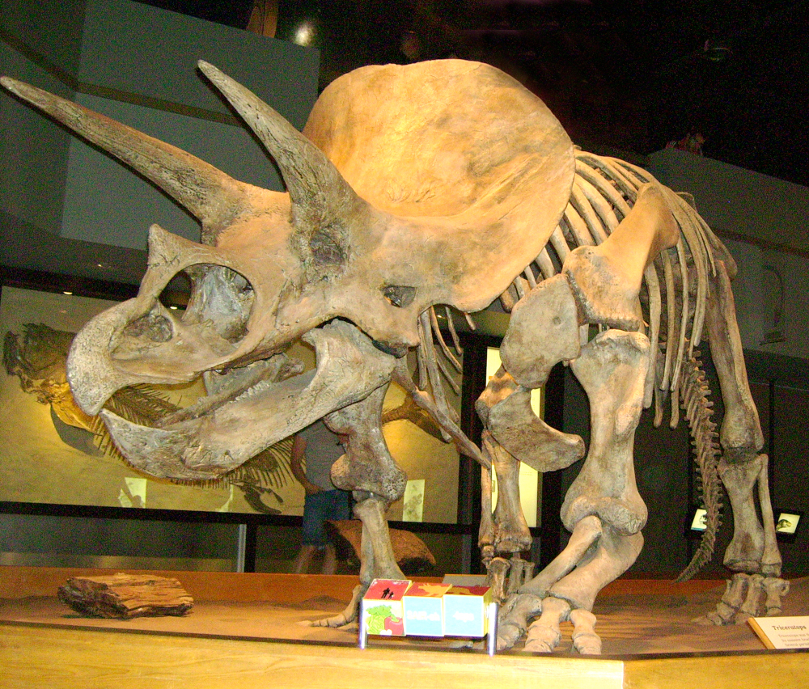
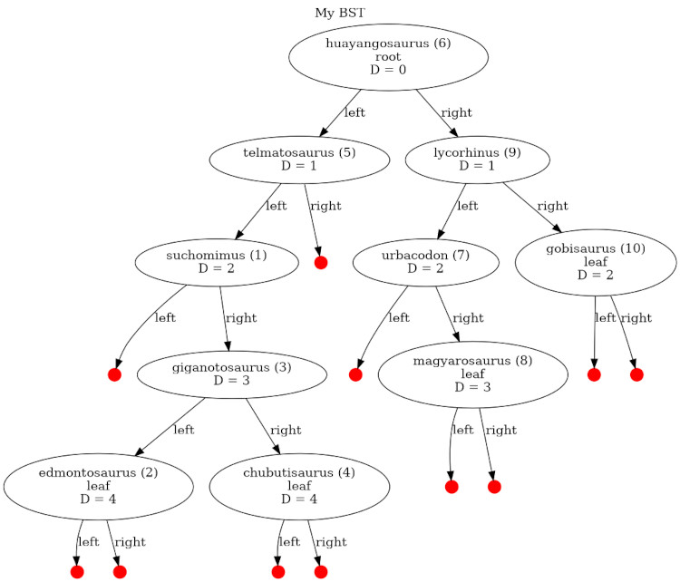

# Project - My Dinosaur Database (BST)

Triceratops Fossil image courtesy of users Redvodka and MathKnight at [Wikimedia.org](https://commons.wikimedia.org/wiki/File:TriceratopsTyrrellMuseum1.jpg)

In this project, you'll do two major things:

1. Solidify your understanding of Binary Search Trees (BSTs)

2. Implement simplified database of Dinosaurs (yaaaaay!)

## Source Files

Don't let the number of source files intimidate you. You only need to work on three:

1. MyBST.hpp

2. MyDinosaurDatabase.cpp

3. Dinosaur.cpp

### Helper Methods

You may add helper methods to classes within the above source files, but do not remove or modify any existing methods. Unit tests to determine your grade will be run against the code in the above files.

Be sure to read notices at the top of each file. Some files must not be edited (at penalty of all grading points). Other files *may* be edited, if you wish.

### Make Commands and TUIs

It is recommended you use the `make` command to see a menu first. Next, use `make run-integers` to play with your binary tree. This program presents a simple TUI (text user interface) that lets you fill your BST with integers. After your tree works correctly, you'll want to move on to `make run-dinosaurs` to see a slightly more interesting use of a BST.

### Live Updating Image of Your BST

You'll also notice the TUI programs generate PNG images of your BST in the background whenever you manipulate them. The images are stored next to your other source files. It would probably be helpful to open the PNG file in an image viewer (one that auto updates when the image changes) and pin the viewer to *Always On Top*, so you can watch your BST change as you manipulate it within the TUI.

Note that the graph will not generate without the *dot* tool installed, which can be installed with `sudo apt install graphviz`.

### sandbox.cpp

If you wish to make a custom program to help your debugging/development, you should edit the *sandbox.cpp* file. It starts completely empty but you may put anything there that you wish, to play around.

### Embedded Hints

As always, you should carefully inspect source files for hints and instructions written as comments, and a skeleton structure of your implementation files. You won't need to change arguments, return types, or method names; All you need to do is complete the body of each methods. Not all methods actually need anything inside them, but that is for you to decide. You may also remove placeholder code (next to *YOUR CODE HERE*), as it exists just to make your empty program compile.

You may also find the following video extremely helpful: [Click Me](https://www.youtube.com/watch?v=yRKh34Ofg50)

## Implementing Your Binary Search Tree

The largest part of this assignment will be implementing a Binary Search Tree that can hold any data type in its nodes. You'll need to implement many methods to get it working correctly. It is recommended to use the simple `int` data type to store inside your BST while you code, rather than using a more complicated data type. The *integers tui* helps make this easy.

## Implementing the Dinosaur Database

Once your BST works correctly with integers, you'll want to work on the actual Dinosaur Database. The `MyDinosaurDatabase` class is actually pretty simple: It's just a wrapper around your BST, so the user can feel they're interacting with a database rather than a tree.

One important thing you shouldn't forget is the `Dinosaur` class. Inside `MyDinosaurDatabase`, your BST holds instances of `Dinosaur` rather than instances of `int`. This will only work once you've implemented all operator overloads for the `Dinosaur` class, since the BST needs to know how to sort instances.

Remember: BSTs that hold instances of `int` are easy because the machine already knows how to compare them. But BSTs that hold instances of custom classes are more complicated. How will your BST know to place a new data value on the left or right of some parent node if the operators aren't implemented? Check code comment nodes for more detail.

## Extra Credit Opportunity

Depending on which semester this is, there may be an extra credit opportunity enabled for this project. Ask your professor for clarification.

If we're using Gradescope for unit tests, it will attempt to measure the exact number of instructions your program executes while running the leak detector. Instruction counts will then be added to a special Leaderboard, alongside your grade on Gradescope.

The top winners for Most Efficient Implementation (i.e., least instructions executed) will receive extra credit. If this brings you past 100% for the category holding this project grade, the points will be allowed to spill over into your overall grade. Needless to say, your submission must pass all tests and have no manual deductions to qualify.

May the odds be ever in your favor,

## Submission

As before, we'll be using [Github](https://github.com/) to push code, but [Gradescope](https://www.gradescope.com/) to submit for grading. Do not only submit to Github. If you forget to submit through Gradescope, you will receive a zero grade.

Please note that all grades are subject to further deductions via manual grading, as needed.

## Copyright Notice

This assignment and its original content are Copyright 2024 Mike Peralta, all rights reserved unless otherwise specified. No content may be shared, uploaded, or distributed unless otherwise noted or permission given.

Authorization is given to students enrolled in this course to reproduce this material exclusively for their own personal academic use.

If you are an instructor wishing to use this assignment for your own course, send me an email :)

## Acknowledgements

Special thanks to *kjanjua26* for their free Dinosaur information dataset, found here: [Jurassic Park Dinosaur Dataset](https://github.com/kjanjua26/jurassic-park).

Special thanks to Brenden Dack, for his time and enthusiasm in being the first person to try this project before release, which resulted in fixes for some typos and starter code.

